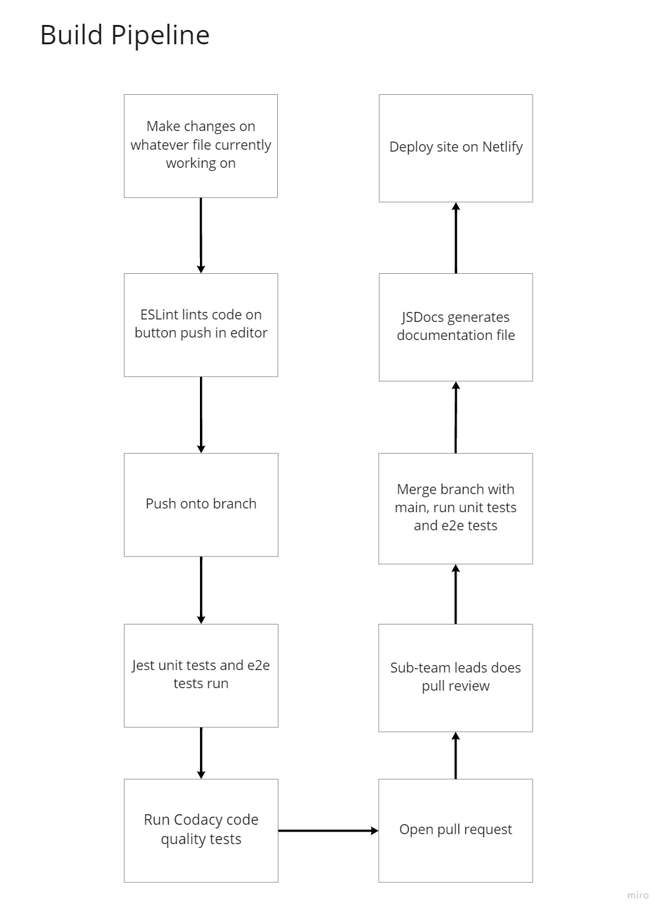

# pipeline phase1

For each topic, write the following:

- which technology we're using
- on which events it triggers (push, pull requests, etc.)
- what's currently functional
- planned functionality in the future

## Linting

- Using ESLint extension for VSCode
- Checks formatting of the code and displays an error if the formatting isn't right. This includes enforcing documentation for JavaScript functions.
- Reformats the code according to standard on saving

## Code Quality via Tool

- Using Codacy
- Triggers on pushes/pulls on personal branches
- Checks code quality (such as having unused or unsigned variables) and security of the code.
- So far, it is a little bit slow and we are trying to lower the runtime by possibly getting rid off extra checks or limiting which files the Codacy will run checks on

## Code Quality via Human Review

- Using GitHub branch protections
- Any pull request on main branch
- Require pull requests before merging with main branch, as well as requiring 1 approval (from a team lead) before merging and review from Code Owners.
- No issues so far, possibly modifying protections later if could result in a better workflow

## Unit Tests via Automation

- Using Jest and puppeteer
- Triggers on push to all branches and merge to main
- We currently have a simple dummy unit test and e2e test.
- We plan on added more tests as more components for our app get developed.

## Documentation Generation via Automation

- Using JSDoc.
- Triggers on push to main.
- Checks for uploads in 'source' directory and generates documentation based on comments in JS files.
- Documentation is on a separate branch 'jsdoc', using github pages to display it, which can be found [here](https://cse110-fa21-group33.github.io/cse110-fa21-group33/).

