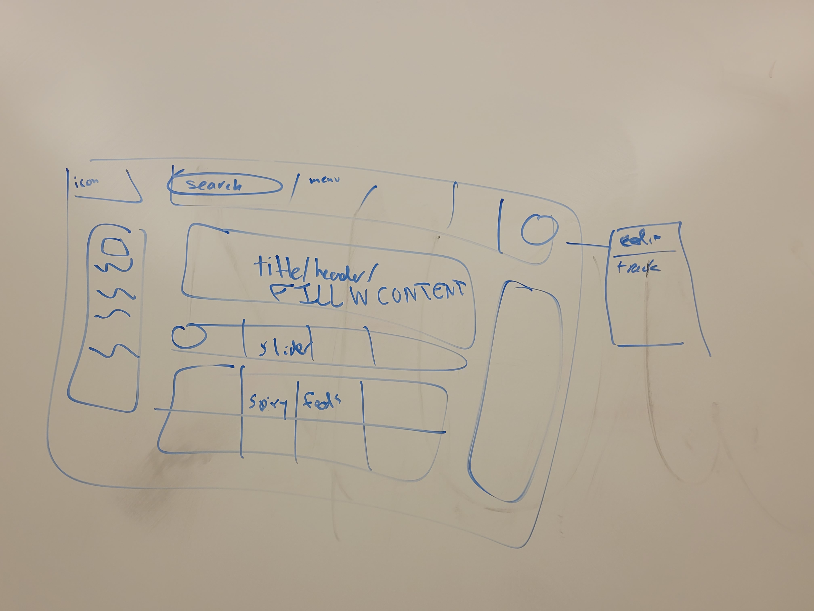

# 102121-brainstorm

Group 33: Exploding Cats

Meeting type: Brainstorm

When: Thursday, 10/21/21, 6:20pm - 7:40pm

Where: CSE Building - Lab 240

Members Present -

- Cole
- Edward
- Everett
- Kevin
- Lorenzo
- Lynn
- Minghui
- Yuang
- George

Members Absent - None

## Full Agenda:

- Old business:
    - User profiles (Go through everyone's profiles)
    - **Announcement:** Asynchronous slack stand-ups
- New business
    - Lab pairing - should we make a channel for anyone who wants to pair up for labs?
    - Decisions to make:
        - Who is our target audience
        - What features should we put in
            - Prioritize what we need/don't need
        - How would this type of user walk through the website
    - Planning for Saturday meeting

### Meeting Minutes

User Profiles

- Who is our target audience?

Features

- Notes, media, etc
    - User Profiles
        - Yuang:
            - Very busy computer science student
                - Wants recipes that are easy to cook, full of energy, stored easily, cheap
            - Party person
        - Edward:
            - Athletes:
                - Daily meal planning
        - Lorenzo:
            - Video games:
                - Level system
                - Quick, easy to prep, cook, clean
                - 
        - Lynn:
            - Cats:
                - Halloween party:
                    - Seasonal recipes, recipe shifts with party size, pictures with comments, bookmarks
                - Cat treats:
                    - Sections for cats w dietary restrictions, cat makes messes so phone needs to be kept at a safe distance so printing/audio recipe
                - Small chef:
                    - Wanting to convert between US and metric system, bad at following directions so wants to lower certain recipe ratings
        - Kevin:
            - Pokemon:
                - Wants to eat recipes either inspired or from the game
                - Pokeballs instead of stars
                - Explorable map with quests of recipes or gym leader dishes
                - Separate dishes into tiers and unlock pokemon by completing dish, kinda gatcha-ey
                - Exploding Mew
        - Minghui:
            - Quick & Easy:
                - No time for cooking, contains quick and easy recipes
                - People are alone, so ingredients should be small and few
                - Difficulty rating system
                - Explore section with ordering
                - Categorizing recipes by things such as time it takes to cook
        - Tanyungfeng:
            - something
                - Have to control pace of each meal to know what to or not to eat
                - Option for breakfast, lunch, dinner
                - Differing exercise levels
        - Everett:
            - Spicy:
                - Sorted by chili pepper instead of rating system, avoids weighted system
                - Different emojis for different tags
                - Modifying exploding cat to exploding with spice levels
                - Large database of spicy foods
                - Slider of spice desired, brings highest rated food for each spice level
                - A user completes spicy recipe, highest spice pepper can be stored and used as user profile
        - Cole:
            - Recipe linked with alcoholic drink:
                - Search by either food or drink
                - Allowed to drink while cooking, very simple UI
        - George:
            - UCSD recipes:
                - Pull up recipes by local grocery stores on campus
                - Sort by college
            
    
    Kick in the Kitchen [tentative]:
    
    - Pepper system where you unlock recipes by completing increasingly spicier recipes
    - You can search previously unlocked recipes based on spice
        - Most thumbed up recipes show first
    - Unlocked spice levels can give you a user level such as Jalapeno Joe
    - Locked and unlocked recipes separate to prevent not being allowed to cook desired spice level
    - Pairing system with spice, x recipe needs some milk, y recipe needs vanilla ice cream
    - Spicy challenge, create daily recipes of increasing spice
    
    

    Things to research **(Due this weekend before Tuesday's meeting)**
    
    - User database - Everett, Lorenzo
    - Implement database of the item - Same as above
    - Uploading photos on the website - Edward
    - How to host the website - Free to research
        - Run locally on a server (Everett)
        - Heroku
            - Can update automatically from GitHub
        - Firebase
    - Popup windows/popup menu (the way intended for the profile) - Lynn, Free for anyone
    - Cookies - Free for anyone
    - Sliding cards (for the explore) - Lynn, Free for anyone
    - GitHub Workflow
    
    To sketch **(Due Saturday)**
    
    - Sign in screen - Cole
    - Recipe page - Lynn
    - Create/Edit recipe - Lorenzo
    - User page - Minghui
    - Sign up - George
    - Post search screen - Edward
    - User edit page - Tanyunfeng
    - Challenge page - Kevin
    

### Requires Further Discussion

- Flow diagrams for the user
- Fat-marker sketchups