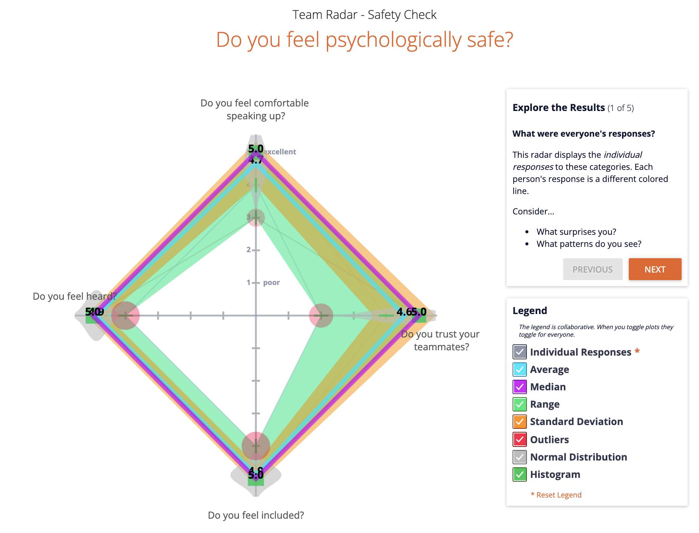
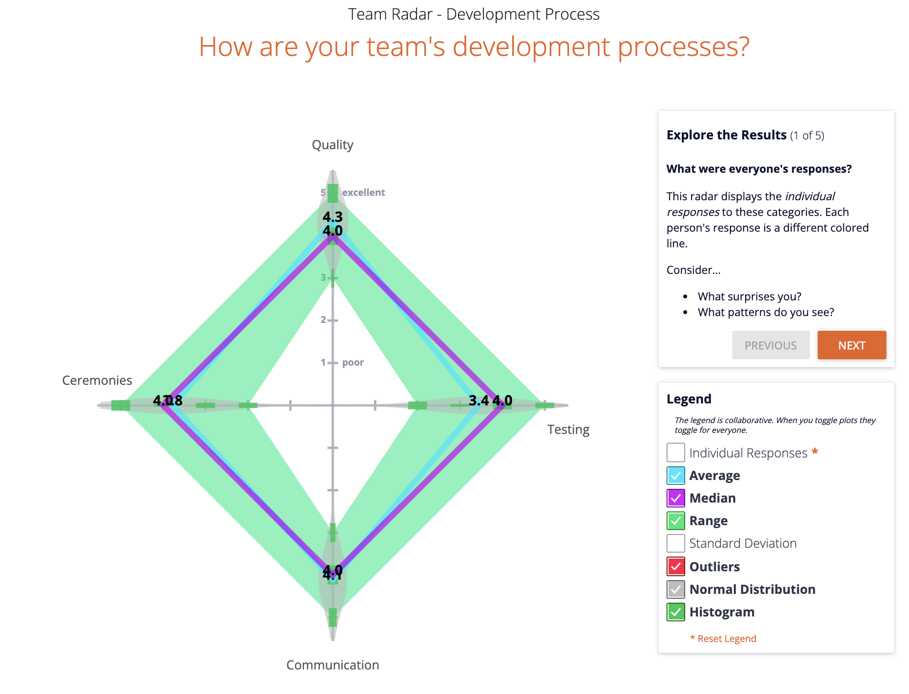
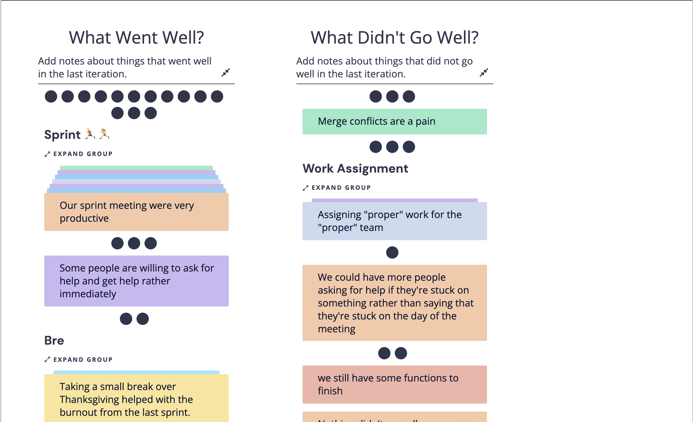
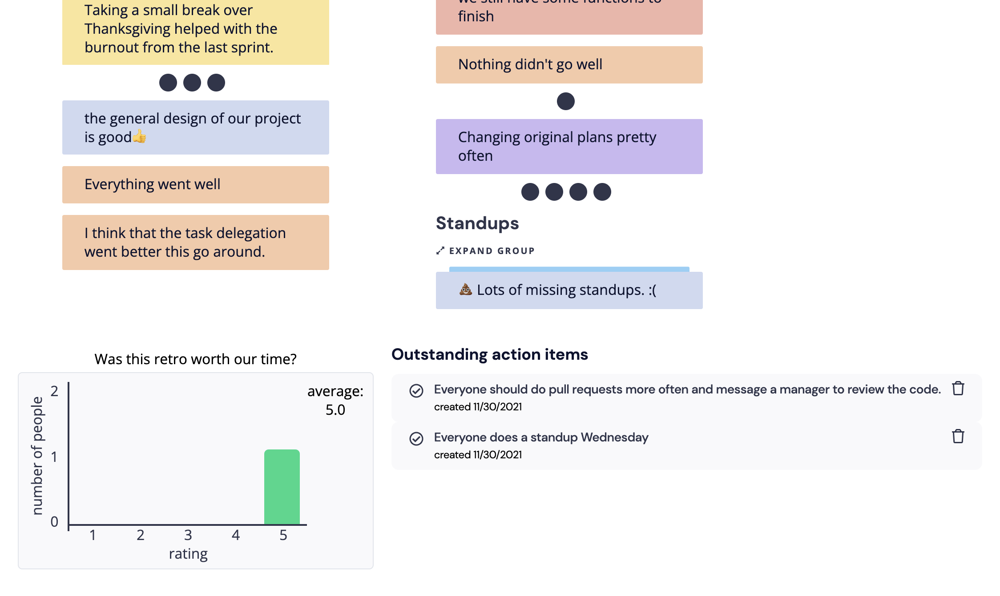

# 113021-retrospective-2

Group 33: Exploding Cats

Meeting type: Retrospective

When: Thursday, 11/30/21, 7:30pm

Where: CSE Lab 

Members Present - Everyone

Members Absent - Everett

[Retrospective Link](https://app.retrium.com/team-room/dfb255c3-9ddc-49c7-9bab-e630d9ff3da1?utm_campaign=team-room-invite&utm_content=link-invite&utm_invitedby=rrn%3Auser%3A06c83ffa-99f4-493e-ba5d-30c370d35495&utm_medium=own-referral&utm_source=retrium)

Retrospective Templates

- Team health (psychological safety)

- Development Processes

- What went well/what didn't
    - Went well
        - Overall the sprint went well
        - Extremely productive sprint, we got a functioning SPA in one day
        - Everyone has been attending meetings
    - Wasn't well
        - Not everyone did their asynchronous standups
        - We kinda threw the subteams out the window. People are working on specific tasks based on priority over team-related.
        - Merge Conflicts!!
    
    
    
    
