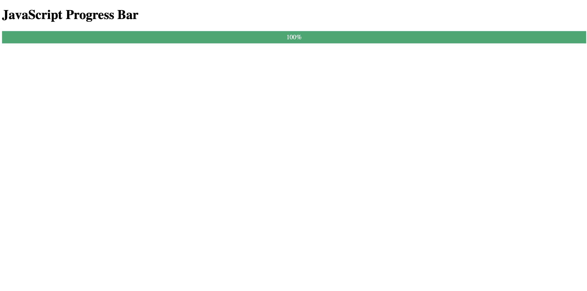
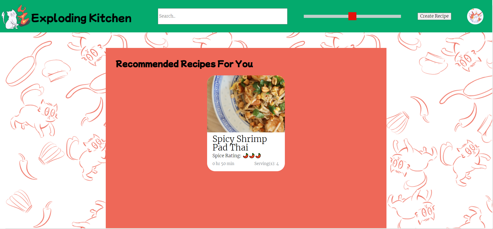
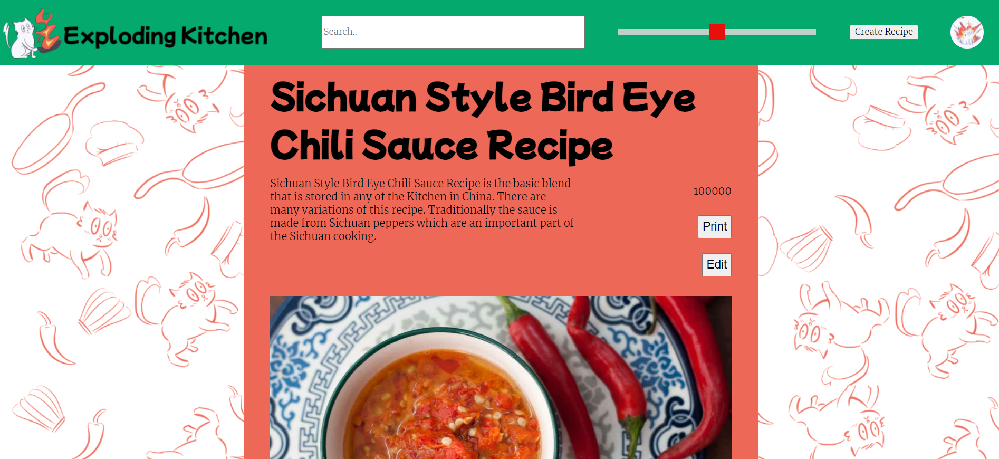
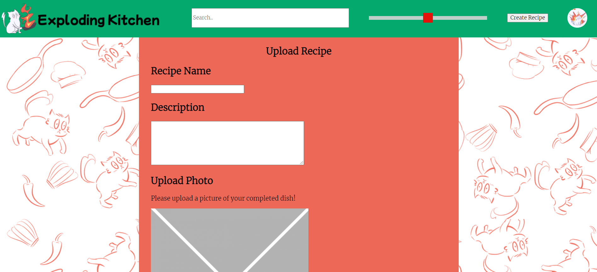
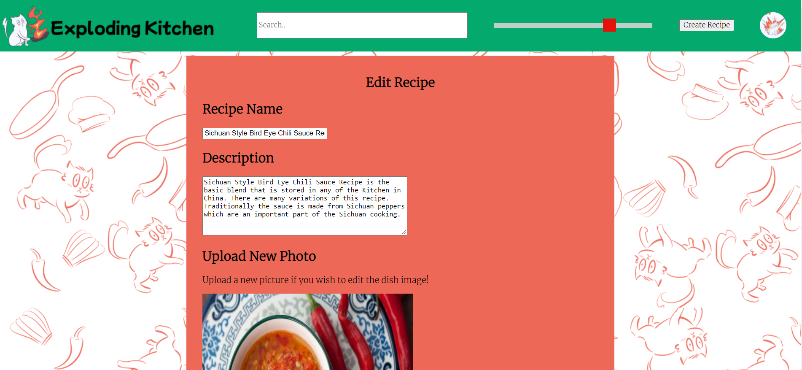
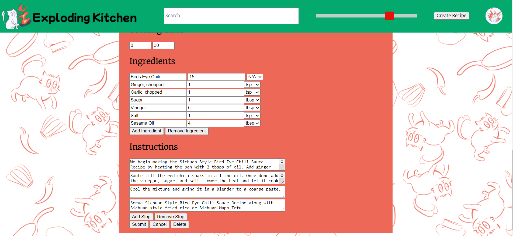

# 113021-sprint-2-review

Group 33: Exploding Cats

Meeting type: Sprint Review

When: Tuesday, 11/16/21, 6:25pm - 6:50pm

Where: CSE Lab 270

Members Present - Everyone

Members Absent -

### Sprint Updates

Cole - Worked on the header bar features as well as making it look nice. Implemented the logo to home page navigation as well as displaying spice level for the slider. Worked on the create/edit recipe page as well as merging different pages to produce a SPA.

Edward - Worked on the e2e tests, specifically why they weren't working. The reason was cause the functions were asynchronous, so the tests would fail because they would test before the method finished. 

Everett - Worked on the create recipe page. Came up with the challenge implementation.

George -  Worked on the edit page, namely filling in forms with data. Cleaned up some of the code for the edit page. Added some units for ingredients into the recipe template. Worked on deleting specific ingredients and instruction steps instead of deleting just the last one. 

Kevin - Worked on merging different pages to produce a SPA. Worked on adding the background to the main page. Worked on general styling of the app as well as producing wireframes. Fixed the bug with IOS devices clicking on recipe card.

Lorenzo - Worked on implementing the dexie database onto the website as well as general debugging for that. Did some repo cleanup as well. Worked on a feature where any crud functionality takes you back to where you were and changes are immediately affected. Edited the README to reflect why specific files are in the repo and added a CHANGELOG to the repo.

Lynn - Added a website logo, drew the background, bound the slider to fetch recipes based on spice, added the favicon, helped with the SPA merging as well as the edit page. Integrated the things that Minghui and George wrote for the editing. Updated the wireframes on the repo. 

Minghui -  Worked with George on the edit page. Integrated the search bar functionality onto the page. Worked on the recipe challenge page. 

Tanyunfeng - Worked on the 'I made this' button. Currently stuck on a bug, but it's getting worked on. 

Yuang - Worked on the progress bar functionality. This will go with the challenges to show challenge progress. Also worked on the styling for it. 

- Progress Bar:

Main Page Layout:

Recipe Display Layout

Recipe Upload (same layout for editing)

Recipe Edit:

