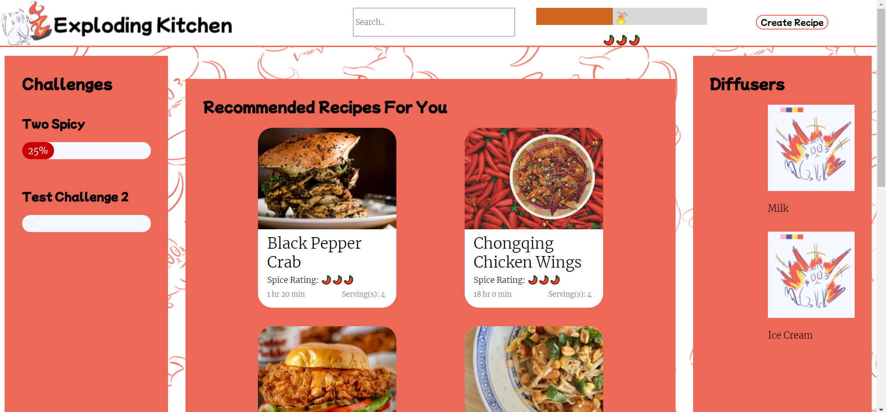
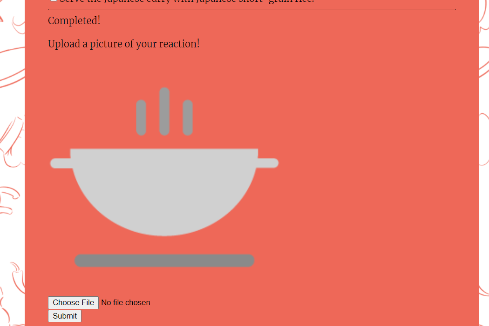
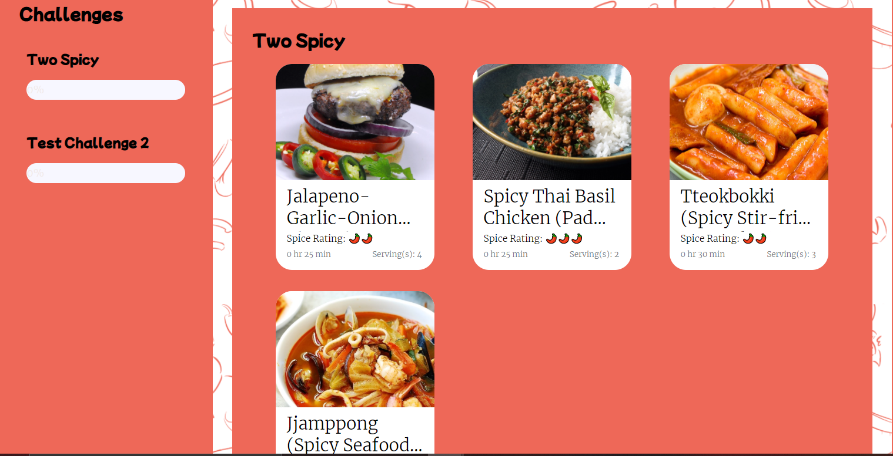

# 120221-sprint-3-review

Group 33: Exploding Cats

Meeting type: Sprint Review

When: Thursday, 12/2/21, 7:40pm - 8pm

Where: CSE Lab 260

Members Present - Everyone

Members Absent -

Cole - Worked on CSS for the navigation bar, specifically the slider. Worked on some recipe jsons. Worked on making images more efficient with Edward. 

Edward - Attempted to get unit tests to work. 

Everett - Worked on recipe upload and edit page. 

George - Attempting to get unit tests to work. Got the ingredient/step add/delete buttons to work.

Kevin - Buttons. Lots of button design. Mostly CSS work.

Lorenzo - Attempted to get the unit tests to work. Added some challenge functionality to our database script. Added some more recipe jsons. 

Lynn - Added challenge progress bar components and functions to show the challenge recipes. Added diffuser section for the main page. Connected challenge frontend and backend.

Minghui - Added the placeholder picture for recipe creations. Implemented user reaction functionality. 

Tanyunfeng - Implemented the 'I made this button'. Finished the challenge list at the bottom of the recipe page. 

Yuang - Finished confetti feature for completing recipes. Currently working on adding icons for challenges. 

