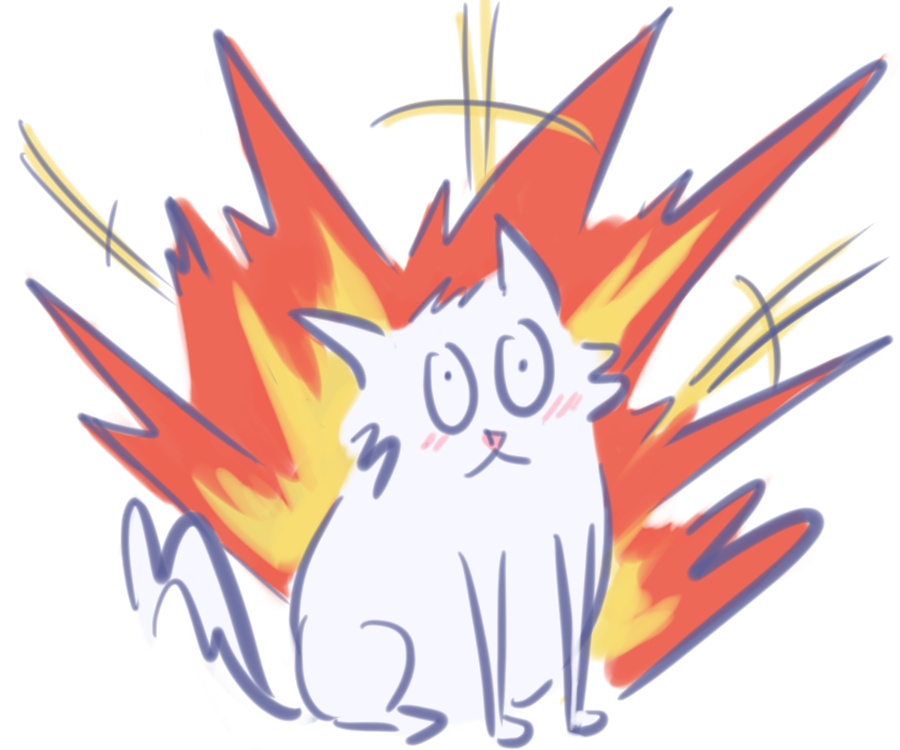

# Exploding Cats
Hi! Welcome to CSE 110 Fall 2021 Group 33's team page. Our team name is **Exploding Cats**. On this page are our team brand, values, and member roster. 
## Brand
### Team Name
The idea behind the name Exploding Cats came when we played [Gartic Phone](https://garticphone.com/), a game where you play telephone, but with drawing. 
Although our members are mostly unassuming and fairly quiet, we found that plenty of our drawings were violent and unexpected. 
When coming up with a team name, we tried conjuring up images of this unusual blend of quiet and violent, and hence, Exploding Cats was born!
### Team Logo

### Team Mascot
As featured in our logo, our team mascot is a white cat named Explodey. Though normally timid and friendly, at any moment, Explodey can erupt into action,
pouncing on unsuspecting victims and leaving havoc wherever he goes.
### Team Colors
Our team colors are [titan white](https://veli.ee/colorpedia/?c=f7f7ff), [pink](http://veli.ee/colorpedia/?c=ffb4c2), [waikawa gray](http://veli.ee/colorpedia/?c=5A6493), [marigold yellow](https://veli.ee/colorpedia/?c=f7dd72), and [burnt sienna](https://veli.ee/colorpedia/?c=ee6352). The white, pink, and gray colors represent Explodey's calm and warm outward appearance. The yellow and sienna represent Explodey's fiery outbursts, like an active volcano ready to go off at any moment. 
## Values
As listed on our [group contract](./misc/rules.md), our team believes and exhibits the following values:
- Humility, Respect, and Trust
- Honesty about mistakes or confusion
- Group accountability
- Inclusiveness
- General courtesy
- Academic integrity

Furthermore, we strongly believe in team communication, regular team meetings, firm yet gentle conflict resolution, and professional coding practices.
## Team Roster
|Name                   |Github               |Year             | Major | Fun Fact |
|-----------------------|-------------------|-------------------|-------------------|-------------------|
|Lynn Dang(Lead)        |[lmidang](https://lmidang.github.io/Github_Pages/)     |2nd year transfer       | CSE | Has been playing ffxiv since 2019 |
|Lorenzo Mendes(Lead)   |[lmendes14](https://lmendes14.github.io/GitHub-Pages/)   |3rd year     | CSE | Has never seen a High School Musical |
|Kevin Lam              |[klam13630](https://klam13630.github.io/CSE110/)     |3rd year          | CE | Once called his brother telling him he couldn’t find his phone… |
|Minghui Li             |[carolli014](https://carolli014.github.io/Lab1-GitHub-Pages/)     |4th year     | Math-CS | Has gotten laser eye surgery |
|Yuang Lin              |[yuang-lin](https://yuang-lin.github.io/User-Page/#yuang's-user-page)    |3rd year      | CSE | Has a collection of about 300 car models and plane models|
|Everett Lin            |[everett-lin](https://everett-lin.github.io/cse-110-lab-week-1/)     |4th year    | CSE | Used to make pixel art sprites for game developers |
|George Gavrilov        |[GeorgeGavrilov](https://georgegavrilov.github.io/CSE110-LAB1/) |4th year     | CSE | A lot of people think he is German because of his accent, but he is not|
|Edward Chang           |[Ed5443](https://ed5443.github.io/CSE110-Lab1/)   |2nd year transfer        | CSE | Has played the piano for 10 years |
|Cole Rindal            |[Cole-Rindal](https://cole-rindal.github.io/Lab-Week-1/)   |4th year | CE | Has over 30 house plants|
|Tanyunfeng Chen        |[CookingC](https://cookingc.github.io/CSE110-2021/)    |4th year      | Math-CS| Can drink 2 pounds of vodka |
