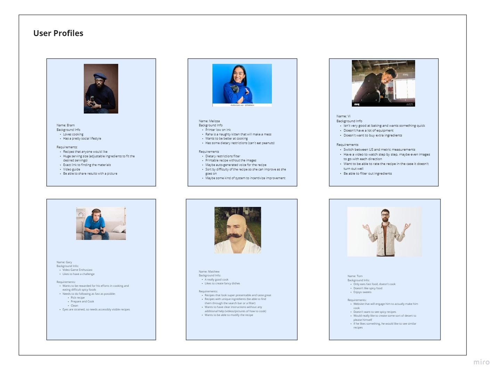
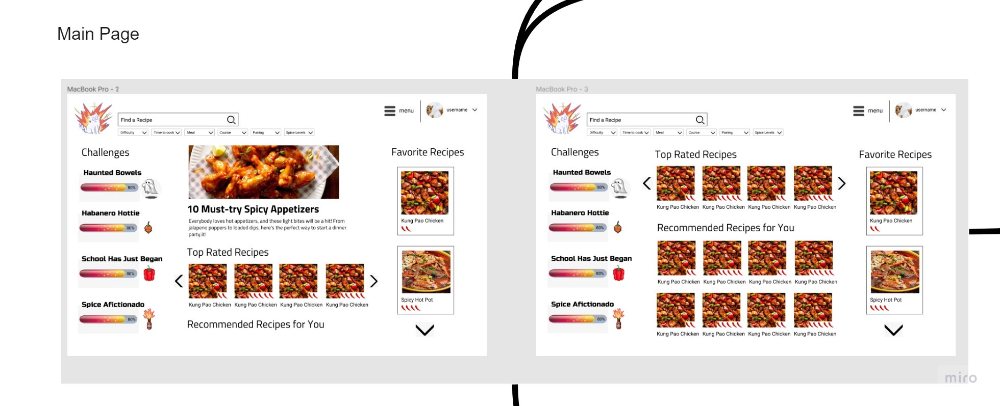
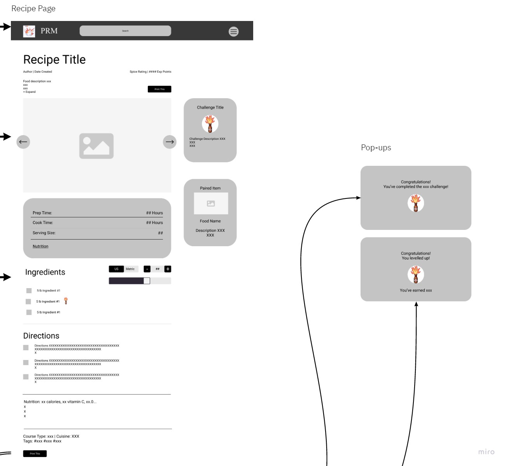
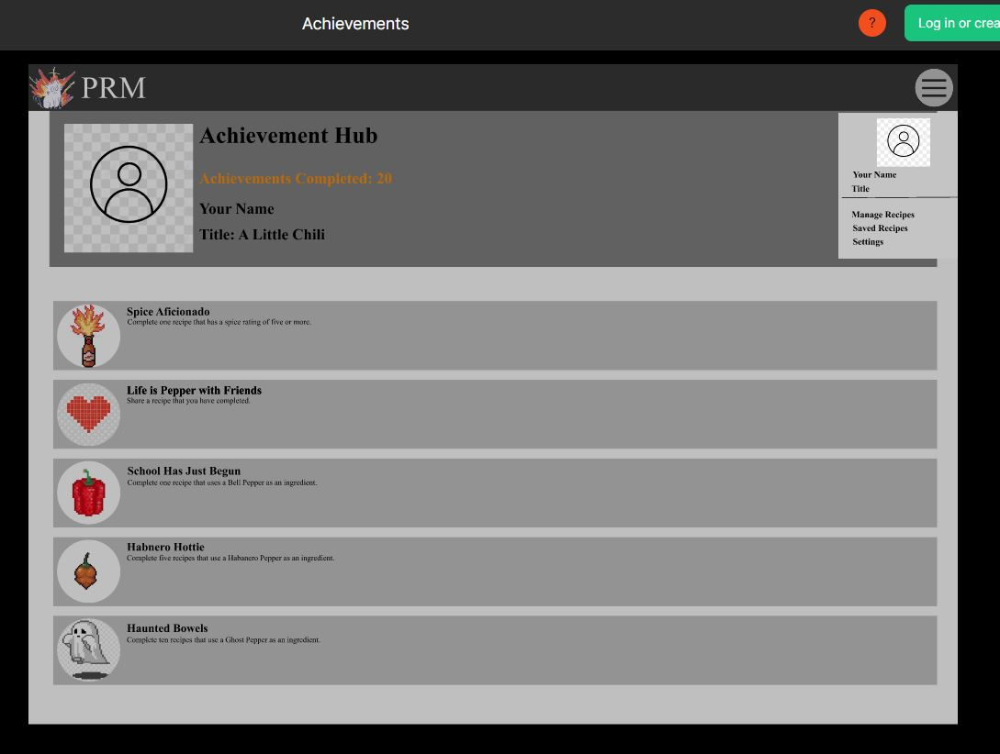
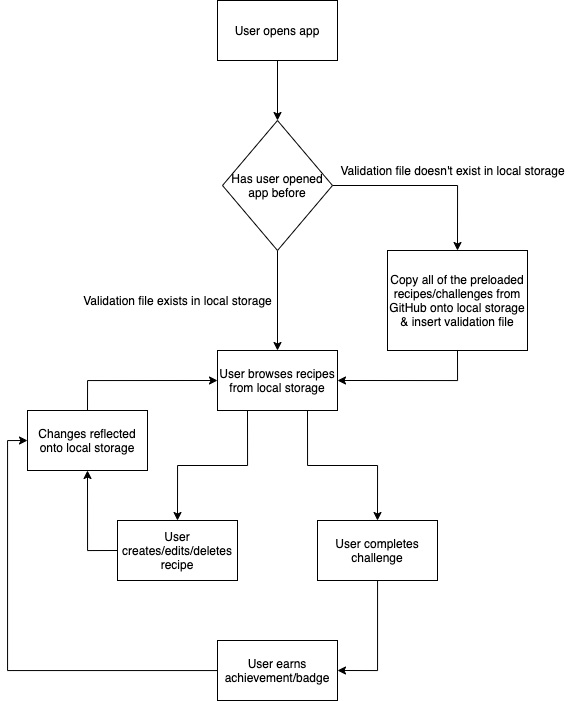

# Project Pitch

Team 33 - Exploding Cats

## Problem

With the prevalence of many cooking websites and large recipe databases, users are often overwhelmed with a wide variety of options. Websites cater themselves to multiple groups of people, embodying the saying "Jack of all trades, but master of none." This leaves users with a clear niche in mind lacking high quality resources to pursue their interests. In particular, we noticed that there are no prevalent applications that focus specifically on people interested in the culture of consuming spicy food. Often, the available resources would provide lists of all spicy foods, but that ignores the desires of the spicy enthusiast -  a challenge lover. How would a user gauge how spicy the dish they are cooking will be? As a new enthusiast with low tolerance, how could they find recipes to help them along in their journey? How could they feel accomplished upon completing a recipe? The problem is clear: there is no specific app which keeps the spicy lover's nature and needs in mind.

## Appetite

In order to solve this problem, we'll have our basic CRUD app functionality in 2 weeks during our first Agile sprint. This means that we'll have our recipe template that'll allow users to create, read, edit, and delete their own personalized spicy recipes by Week 8. Furthermore, we'll have our build pipeline completed by Week 8 so that making further changes is a seamless process. By Week 10, we'll have not only all of our additional functionality such as search filtering and challenge rewards, but we'll have completed most of our front-end development by finishing our UI and UX. 

.jpg)

## Solution

We aim to create the perfect recipe app for both spicy food lovers and noobs. Allowing for spicy food enthusiasts to find recipes and create recipes to build their resistance to spicy food. We will allow users to search for recipes based off of the level of spice allowing lovers of any level of spicy food to satiate their sadistic cravings. Users will be able to track their spicy food tolerance progression through our app's built in challenge and achievement system. 

## Rabbit-Holes

- Storage (local vs external) → hard choice choosing between which one to use. Using external storage (cloud) might be pretty difficult for getting used to and just learn overall. Using local storage is preferable, however, not sure how we would modify local files depending on user input and how we will be saving those changes on our website.

- Searching → finding out what would be the best way to find the proper recipe. Do we just make each recipe as its own JSON file and look up recipes by their JSON file name or... ? How exactly does searching work: modifying the current page and display the recipes which name's matches the input or you have to look up a specific recipe itself? There are many possibilities on how and can be done, both from the technical/implementing standpoint and UI, which might lead to some confusion on how it should be done.
- Challenge validation → again, not sure how we will track users progress on the page to make sure that the challenge is completed. Same thing when it comes to tracking the overall user's progress with challenges, we need a data base, which is something we are trying to avoid for now.

## No-Gos

- User database: We originally thought of implementing a user database such as user login and sharing of recipes. It would be annoying for the user to have amassed a bunch of challenge completions and badges to have lost them all if they get a new device. However, implementing this system would over-complicate things way beyond what's needed for a CRUD app, since that would rely on cloud-based research and development.
- Filtering by tags: Although this isn't completely off the table, we feel like this filtering system should be our lowest priority, as that would require a restructuring of how our recipes are designed and implemented. We will only pursue this feature only after implementing all of our planned features with extra time at the end.
